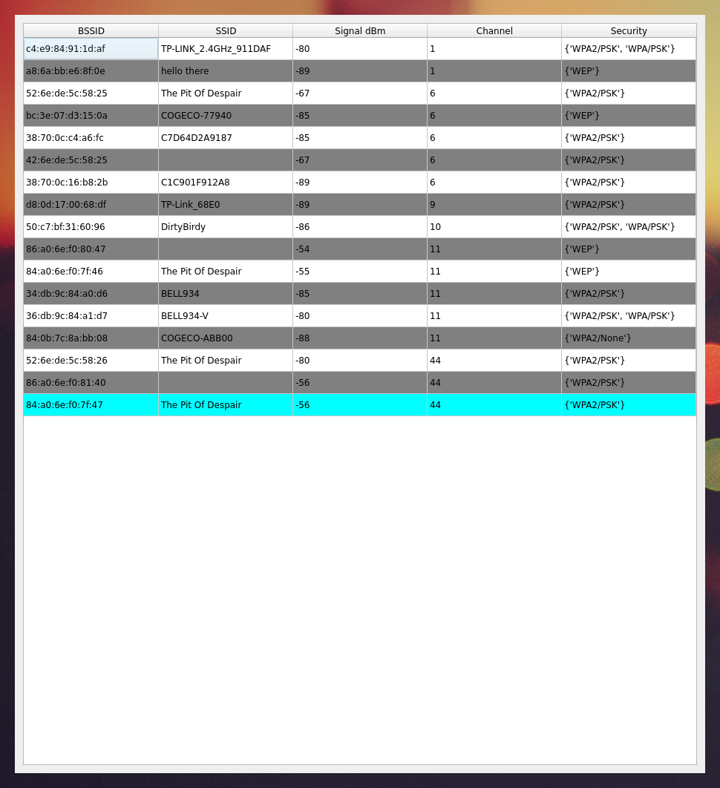

# Computer Networks Final Assignment
A Wi-Fi analyzer for Linux written in Python using the PyQt5 framework for the GUI.

# How to Run
## Dependencies
- Python 3.8
	- pandas
	- pyqt5
	- scapy
- Linux Packages
	- aircrack-ng
	- network-manager
	- iw
	- wireless-tools

## Instructions
1. Install all the dependencies listed.
	- You will need to install Python packages above with sudo privileges
	ex. To install pandas, the command would be: `sudo pip3 install pandas`
2. Run `app.py` with sudo privileges.
	- `sudo python3 app.py`

Program takes a little bit to open to the GUI due to the it having to sniff 200 packets before the list of networks has been fully compiled.

## Output
- The output should be a window that looks like the image below
- All the networks are also outputed to a file located in this folder named `output.txt`
